# Code Atlas

A mobile application made for aspiring competitive programmers. Code Atlas aims to turn the tedious task of learning data structures and algorithms into an exciting coding journey with game-like elements.

Code Atlas is built using java native and Firebase for the application's backend.

## Features

### User Authentication

The application features user auth using the firebase authentication system.

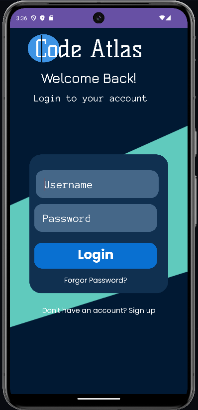
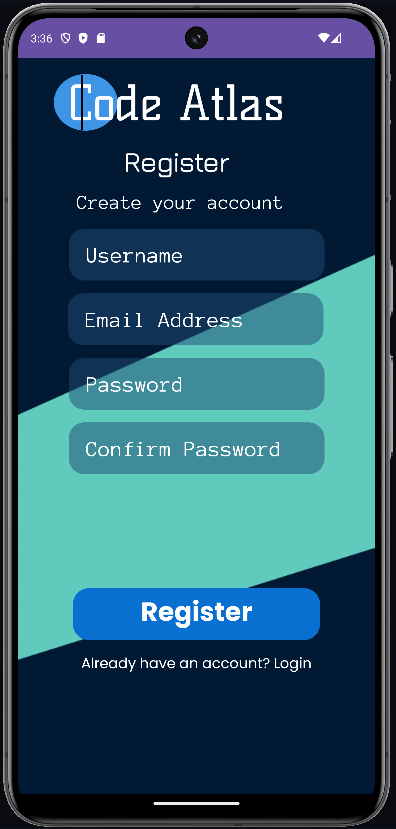

### Competitive Programming Roadmap

Code atlas provides a comprehensive roadmap with a variety of tracks, designed to teach complex concepts in a fun and digestible way.
Users select the track and topic they are interested in, and the application starts by explaining the concepts,
then it will quiz the users in the content that they learned.

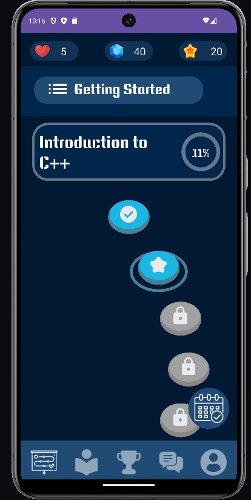
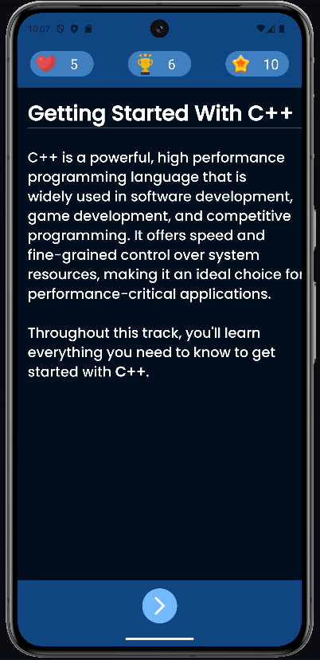
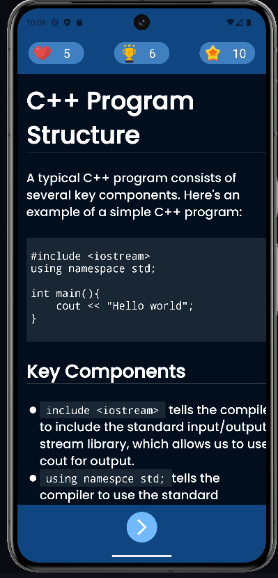

Users get penalized for wrong answers and rewarded for correct answers. For every wrong answer, the user loses a live.
When the number of lives hits 0, the user will need to wait for their lives to regenerate before they could
resume their learning.

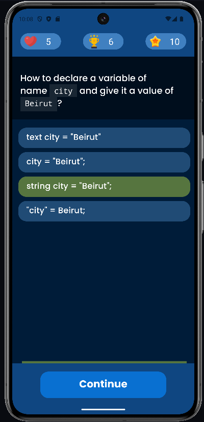
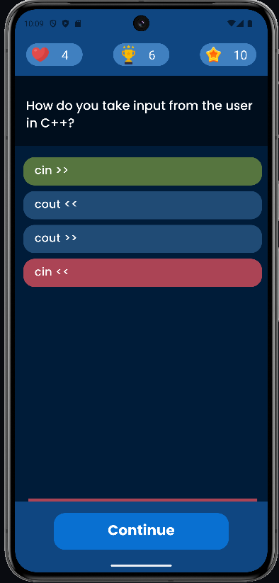

After completing the lessons, the users get a summary of their performance indicating that they completed the level,
and they will be able to access the next level in the current track.

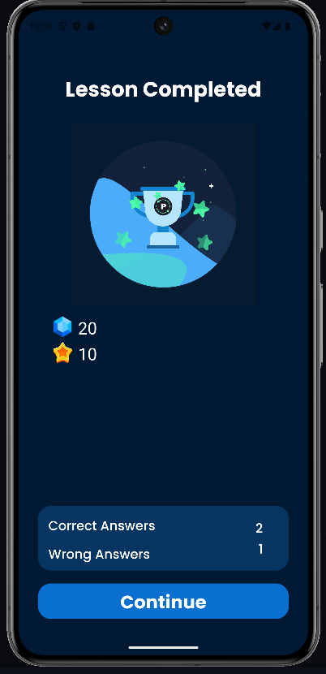

### Articles

The app provides articles on various competitive programming topics with detailed explanations and code examples.

Users can search for the topics they're interested in.

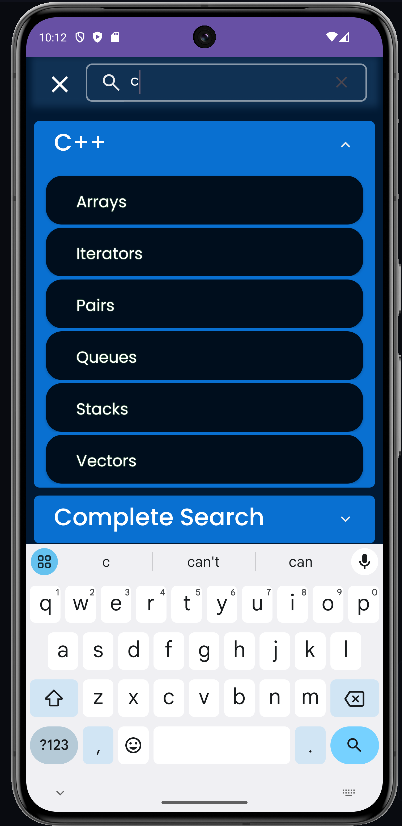
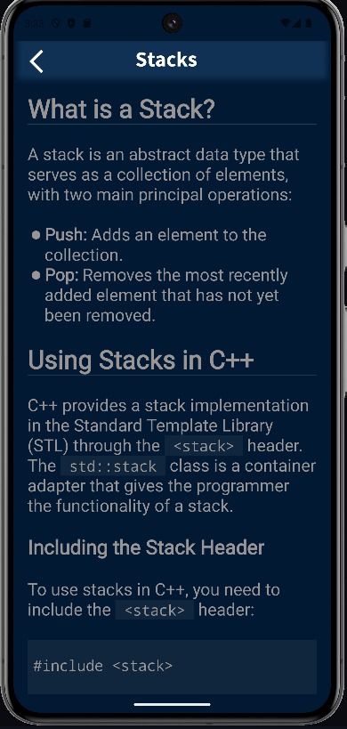

### Codeforces API Integration

The application supports fetching data from the codeforces api to display the incoming events.

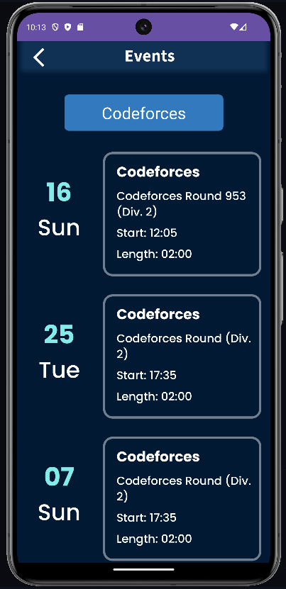

### Community Forums

Code atlas provides a place for aspiring to hold discussions, share insights, and get help from the community
throughout our forums section.

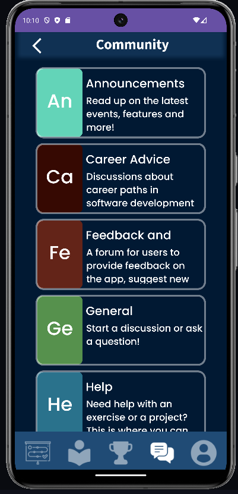
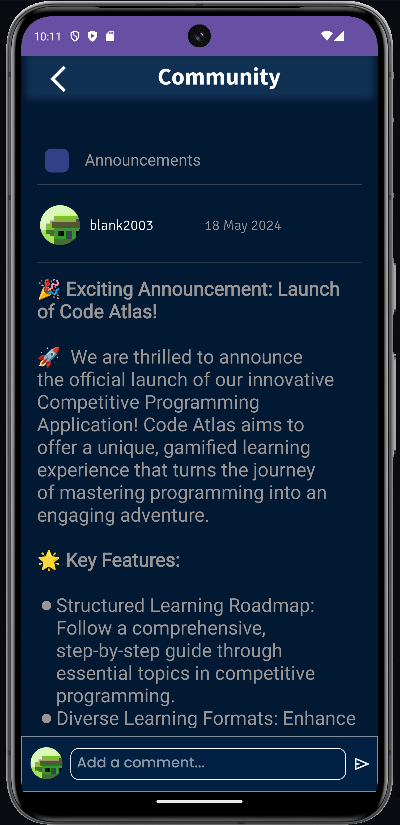

Our community forums are divided into threads. Users can create new posts or comment on existing posts, as well as edit
or delete any of their previous posts.

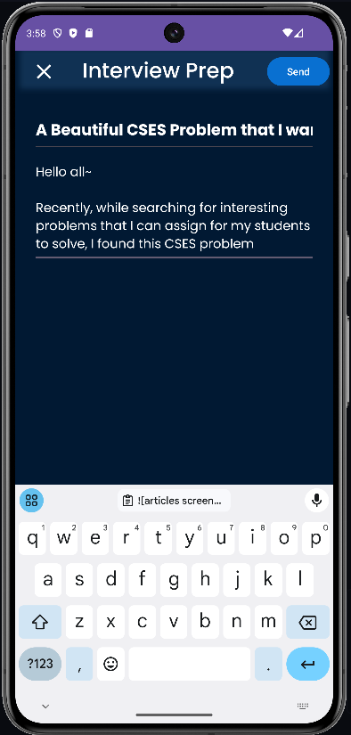
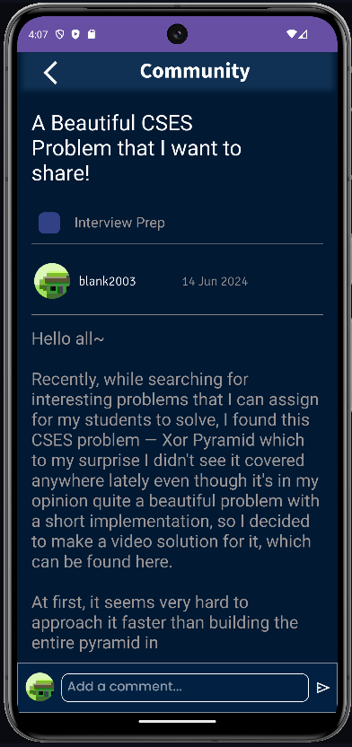

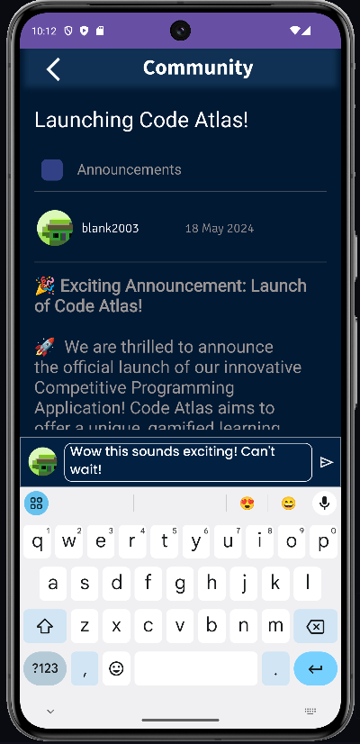

### Leaderboard

In Code Atlas, the equivalent of user xp is called Sparks. Users gain sparks by completing lessons,
and the app features a leaderboard for the users who collected the most sparks.

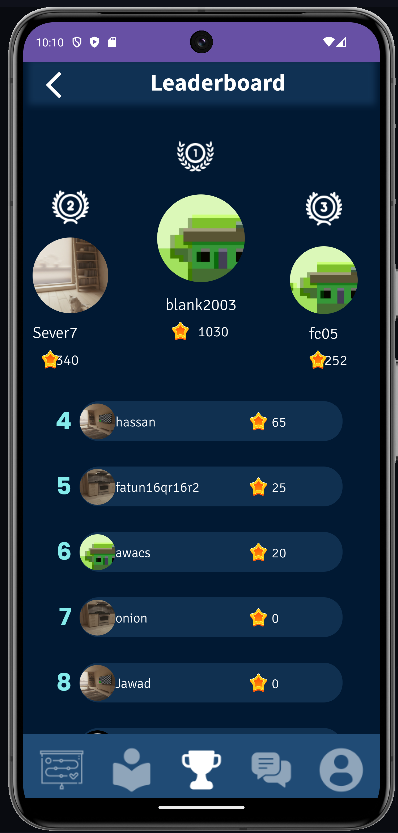
